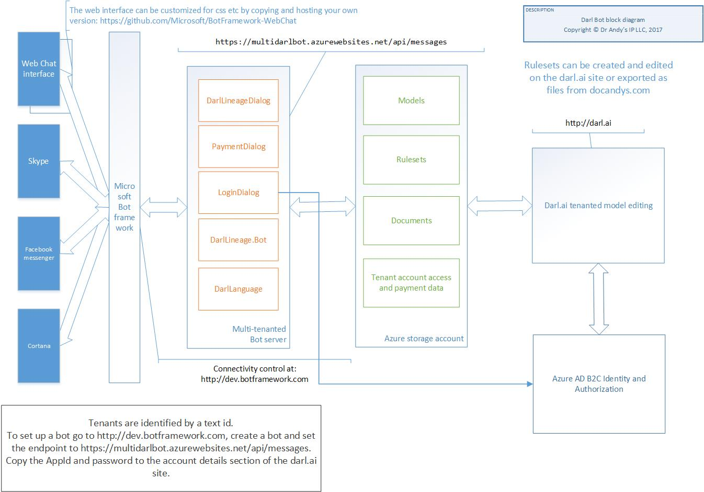

Darl.ai documentation
=====================
Darl.ai is a site that allows you to build and host bots.
It works with the Microsoft Bot Framework (tm) and makes it simple to build a bot that can be accessed via facebook, skype and many other chat interfaces.

It consists of a conversational layer and a rule based layer.

The conversational layer works out the user's intent, and the rule based layer pulls up the appropriate expert system to process data further.

Bots are either undirected, like Alexa or Siri, or directed like most bot framework bots. Undirected bots take in any input and try to make sense of it. Directed bots take over the conversation and direct it.

Darl has an undirected layer over a directed system.
The directed system consists of a user created set of DARL rulesets that can be created using our interactive DARL editor, or mined from real world data through Machine Learning.

To create your bot, just register and either edit the default bot you are given or create your own. To connect it to the outside world, register with the Microsoft BotFramework and copy the AppID and password to our site under the "connectivity" tab.
We will host the bot for you. 
All you then need to do is connect your bot to the various interfaces usng Microsoft BotFramework.

You can keep multiple versions of your bots and switch them in and out using the "connectivity" tab.

