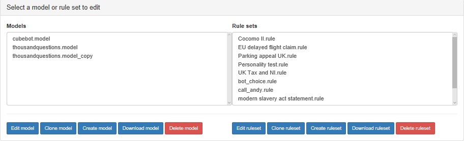

Select Model/Ruleset
===
This is the initial page you see when you edit bots and that you return to whenever you want to change what you are editing.
You can edit bot models or rule sets, and you can clone them, delete them or download them as well.

You select a model or ruleset to act upon and choose one of the buttons below.

# Edit model
Opens the selected model for editing, passing you to the model editing oages.

# Clone model
Copies the selected model and adds it to the list with __copy appended.

# Create model
Creates a new model from scratch with the name you choose and adds it to the list.
# Download model
This downloads a model to your download folder using your browser.

# Delete model
This deletes the selected model permanently. The system will ask you to verify this decision.

# Edit ruleset
Opens the selected ruleset for editing, passing you to the model editing oages.

# Clone ruleset
Copies the selected ruleset and adds it to the list with __copy appended.

# Create ruleset
Creates a new ruleset from scratch with the name you choose and adds it to the list.
# Download ruleset
This downloads a ruleset to your download folder using your browser.

# Delete ruleset
This deletes the selected ruleset permanently. The system will ask you to verify this decision.
